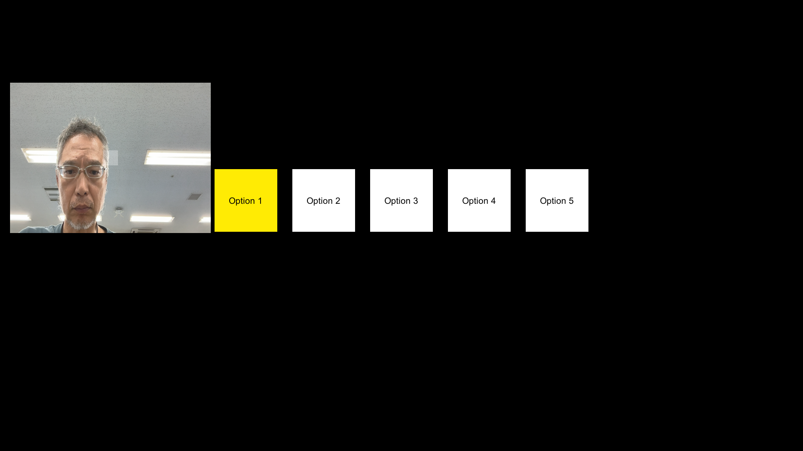

# touchless-cursor-unity

Unity向け非接触(タッチレス)カーソル操作テンプレート。カメラ入力から手の動きを検出し、
アーケード風の「左右移動+決定」UIを操作する。検出エンジンはMediaPipe Hand Landmarkerを
初期実装として使用するが、将来的に他の検出エンジンへの差し替え・追加も想定した名前・構成にしている。

## セットアップ

このリポジトリには検出エンジン(MediaPipe/homulerプラグイン)本体を同梱していない
(ライセンス上問題はないが、ネイティブライブラリ込みで数百MBになるため)。以下の手順で導入する。

1. Unity 2022.3 LTS でこのリポジトリを開く
2. [homuler/MediaPipeUnityPlugin](https://github.com/homuler/MediaPipeUnityPlugin) の
   Releasesから対応バージョンの`.unitypackage`をダウンロードしてインポート
3. `Assets/HandsGesture/Scenes/ArcadeGestureDemo.unity` を開いて実行

詳細な仕組み・設計判断は [`docs/implementation_manual.md`](docs/implementation_manual.md) を参照。

## ライセンス

- 本リポジトリのコード: [LICENSE](LICENSE)
- 依存する MediaPipe / homuler プラグインのライセンス表記: [THIRD_PARTY_NOTICES.md](THIRD_PARTY_NOTICES.md)
